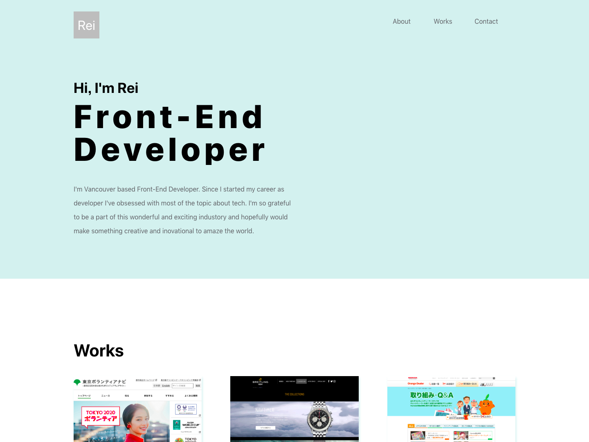

# Rei Yoshizawa Portfolio Website

> This is my personal portfolio web site. It shows my works and projects experience.



## Table of contents

- [Description](#Description)
- [Getting started](#Getting-started)
- [Features](#Features)
- [Status](#Status)
- [Links](#Links)
- [Contact](#Contact)

## Description

- The portfolio concept is simple and user-friendly. To show my skill and experience I didn't want to distract people with many animation or vivid colors. Design should be simple and elegant and easy to read and understand. That's what came to my mind when I started thinking about design and concept about my portfolio.

- This project is made by React. React is definitely the trend technology for front end job. Why not using this it to build the showcase to show my skills and experience.

### Technologies

- HTML5
- CSS3
- JavaScript
- React
- Sass
- BEM
- Visual Studio Code
- Markdown

## Getting started

This project was bootstrapped with [Create React App](https://github.com/facebook/create-react-app). What you need to do is just install and start like the code below.
(Remind node is already installed in your computer)

```shell
npm install
npm start
```

the most recent version of this guide [here](https://github.com/facebook/create-react-app/blob/master/packages/react-scripts/template/README.md). It shows you the lists of available scripts.

## Features

- It shows the personal works and projects

## Status

Project is: _finished_

## Links

- Project homepage: https://www.reiyoshizawa.com/
- Repository: https://github.com/oyyer/portfolio-react
- Issue tracker: https://github.com/oyyer/portfolio-react/issues
  - In case of sensitive bugs like security vulnerabilities, please contact
    reiyoshizawa0418@email.com directly instead of using issue tracker. We value your effort
    to improve the security and privacy of this project!
- Related projects:
  - Visual Translat: https://github.com/oyyer/visual-translate
  - Joy Event: https://github.com/oyyer/joyevent

## Contact

Feel free to contact me!

- Website - Rei Yoshizawa Portfolio Website (https://www.reiyoshizawa.com/)
- Twitter - @oyyer\_ (https://twitter.com/oyyer_)

[Back To The Top](#Rei-Yoshizawa-Portfolio-Website)
